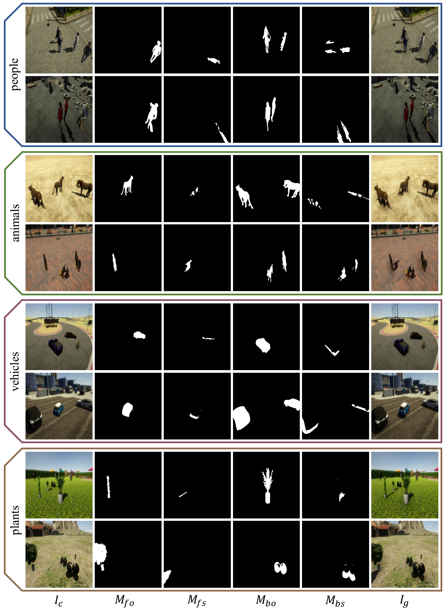

#  Our lab has released the image composition toolbox [libcom](https://github.com/bcmi/libcom), which integrates all the functions related to image composition. The toolbox would be continuously upgraded. Welcome to visit and try :-)
---

# Rendered-Shadow-Generation-Dataset-RdSOBA

We release the rendered shadow dataset used in the following paper:
> **Shadow Generation with Decomposed Mask Prediction and Attentive Shadow Filling**  [[dataset arXiv]](https://arxiv.org/pdf/2306.17358.pdf) 
>
> Xinhao Tao, Junyan Cao, Yan Hong, Li Niu
>
> Accepted by AAAI 2024

**RdSOBA** is a large-scale Rendered Shadow Generation dataset containing object-shadow pairs like [**DESOBA**](https://github.com/bcmi/Object-Shadow-Generation-Dataset-DESOBA) dataset with 600 2D scenes and 788 3D foreground objects, which is useful for supervised shadow generation methods.

## Highlights

- 788 3D foreground objects
- 4 super-categories for foreground objects, containing "people", "animals", "vehicles", "plants"
- nearly 80,000 pairs of object-shadow pairs
- accurate object and shadow masks
- 30 3D scenes
- 20 viewpoints(2D scene) for each 3D scene

## Downloads
We provide the full dataset at [[Baidu_Cloud]](https://pan.baidu.com/s/1ZGQJLUGGDoA88MhV2T5sag) (access code: ck81) and [[OneDrive]](https://1drv.ms/f/s!AoAsEmY10BjHggCPx9_cUX22NMGe?e=6Gj7E9).

## Construction Pipeline

### Constructing 3D Scenes
We use Unity-3D to create 3D scenes and render images. We gather 788 diverse 3D objects from CG websites and 30 representative scenes from Unity Asset Store and CG websites. These collections provide a strong foundation for generating varied rendered images.

For each scene, we select 20 open areas for 3D objects, and choose 10 camera settings per area. After positioning the camera, we place a group of 1-5 3D objects in its view. We do this for 10 object groups per camera setting. Lastly, we render a set of 2D images under 5 different lighting conditions.

### Rendering 2D Images
After determining an open area, camera setting, group of 3D objects, and lighting condition in a 3D scene, we generate a set of images. First, we render an empty image $I_{empty}$.

We place $K$ 3D objects and toggle their visibility one by one. For the $k$-th object, we render images with and without shadows, $I_{o,k}$ and $I_{os,k}$. We calculate object and shadow masks, $M_{o,k}$ and $M_{s,k}$, based on these images.

Finally, we render an image $I_g$ with all object shadows. Designating one object as foreground, we create foreground and background masks for objects and shadows. We calculate $I_c$ using these masks, obtaining a tuple $(I_c,M_{fo},M_{fs},M_{bo},M_{bs},I_g)$ in the DESOBA dataset format.

After filtering out low-quality tuples, we have 280,000 1080p tuples left. For details such as how the images are named, please check the README.txt file in the above link.

## Other Resources

+ [Awesome-Object-Shadow-Generation](https://github.com/bcmi/Awesome-Object-Shadow-Generation)
+ [Awesome-Image-Composition](https://github.com/bcmi/Awesome-Image-Composition)
